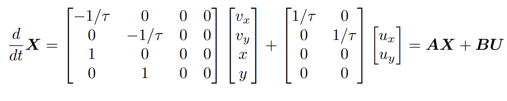
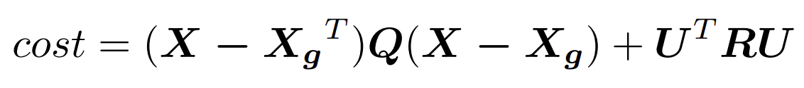
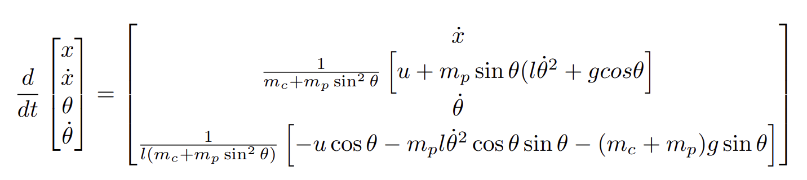
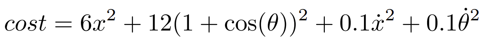
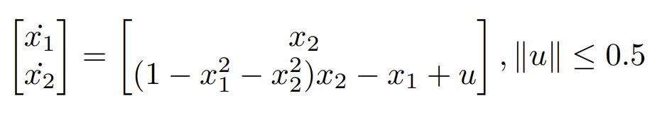
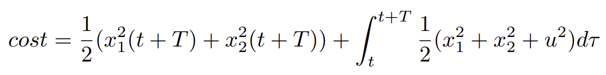

# Enviroments

| Name | Linear | Nonlinear | State Size | Input size |
|:----------|:---------------:|:----------------:|:----------------:|:----------------:|
| First Order Lag System | ✓ | x | 4 | 2 | 
| Two wheeled System (Constant Goal) | x | ✓ | 3 | 2 | 
| Two wheeled System (Moving Goal) (Coming soon) | x | ✓ | 3 | 2 | 
| Cartpole (Swing up) | x | ✓ | 4 | 1 | 
| Nonlinear Sample System Env | x | ✓ | 2 | 1 | 

## [FistOrderLagEnv](PythonLinearNonlinearControl/envs/first_order_lag.py)

### System equation.

You can set arbinatry time constant, tau. The default is 0.63 s

### Cost.

Q = diag[1., 1., 1., 1.], 
R = diag[1., 1.]

X_g denote the goal states.

## [TwoWheeledEnv](PythonLinearNonlinearControl/envs/two_wheeled.py)

### System equation.

### Cost.

Q = diag[5., 5., 1.], 
R = diag[0.1, 0.1]

X_g denote the goal states.

## [CatpoleEnv (Swing up)](PythonLinearNonlinearControl/envs/cartpole.py)

## System equation.

You can set arbinatry parameters, mc, mp, l and g. 

Default settings are as follows:

mc = 1, mp = 0.2, l = 0.5, g = 9.81

### Cost.

## [Nonlinear Sample System Env](PythonLinearNonlinearControl/envs/nonlinear_sample_system.py)

## System equation.

### Cost.

