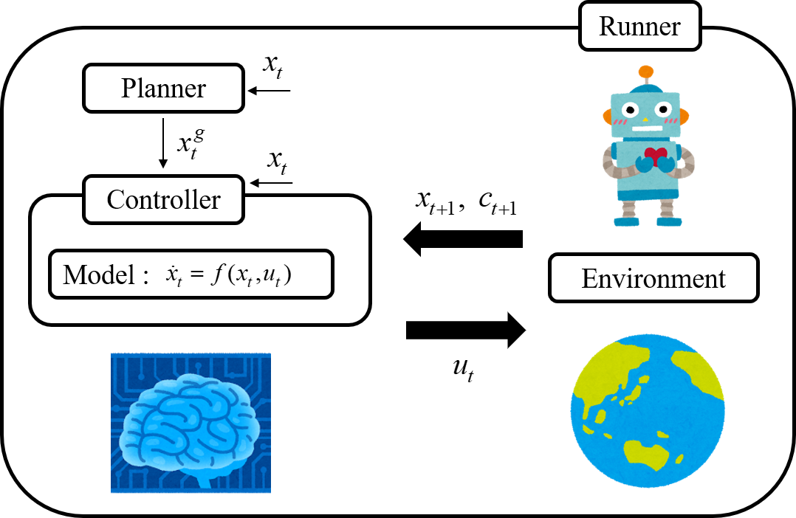
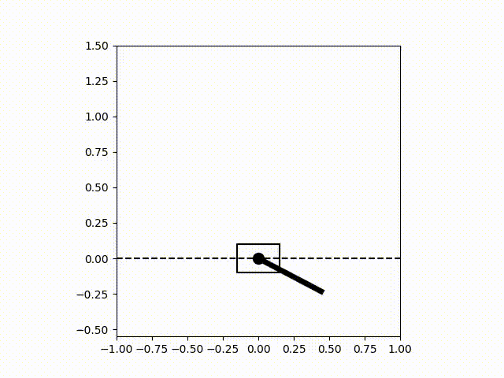
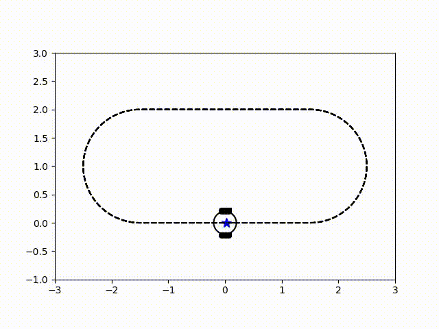

[](https://coveralls.io/github/Shunichi09/PythonLinearNonlinearControl?branch=master&service=github)
[]()
[](https://travis-ci.org/Shunichi09/PythonLinearNonlinearControl)

# PythonLinearNonlinearControl

PythonLinearNonlinearControl is a library implementing the linear and nonlinear control theories in python.
Due to use only basic libralies (scipy, numpy), this library is easy to extend for your own situations.

<div></div>

 

# Algorithms

| Algorithm | Use Linear Model | Use Nonlinear Model | Need Gradient (Hamiltonian) | Need Gradient (Model) | Need Hessian (Model) |
|:----------|:---------------: |:----------------:|:----------------:|:----------------:|:----------------:|
| Linear Model Predictive Control (MPC) | ✓ | x | x | x | x |
| Cross Entropy Method (CEM) | ✓ | ✓ | x | x | x |
| Model Predictive Path Integral Control of Nagabandi, A. (MPPI) | ✓ | ✓ | x | x | x |
| Model Predictive Path Integral Control of Williams, G. (MPPIWilliams) | ✓ | ✓ | x | x | x |
| Random Shooting Method (Random) | ✓ | ✓ | x | x | x |
| Iterative LQR (iLQR) | x | ✓ | x | ✓ | x |
| Differential Dynamic Programming (DDP) | x | ✓ | x | ✓ | ✓ |
| Unconstrained Nonlinear Model Predictive Control (NMPC) | x | ✓ | ✓ | x | x |
| Constrained Nonlinear Model Predictive Control CGMRES (NMPC-CGMRES) | x | ✓ | ✓ | x | x |
| Constrained Nonlinear Model Predictive Control Newton (NMPC-Newton) | x | ✓ | x | x | x |

"Need Gradient" means that you have to implement the gradient of the model or the gradient of hamiltonian.  

Following algorithms are implemented in PythonLinearNonlinearControl

- [Linear Model Predictive Control (MPC)](http://www2.eng.cam.ac.uk/~jmm1/mpcbook/mpcbook.html)
  - Ref: Maciejowski, J. M. (2002). Predictive control: with constraints.
    - [script](PythonLinearNonlinearControl/controllers/mpc.py)
- [Cross Entropy Method (CEM)](https://arxiv.org/abs/1805.12114)
  - Ref: Chua, K., Calandra, R., McAllister, R., & Levine, S. (2018). Deep reinforcement learning in a handful of trials using probabilistic dynamics models. In Advances in Neural Information Processing Systems (pp. 4754-4765)
    - [script](PythonLinearNonlinearControl/controllers/cem.py)
- [Model Predictive Path Integral Control of Nagabandi, A. (MPPI)](https://arxiv.org/abs/1909.11652)
  - Ref: Nagabandi, A., Konoglie, K., Levine, S., & Kumar, V. (2019). Deep Dynamics Models for Learning Dexterous Manipulation. arXiv preprint arXiv:1909.11652.
    - [script](PythonLinearNonlinearControl/controllers/mppi.py)
- [Model Predictive Path Integral Control of Williams, G. (MPPIWilliams)](https://ieeexplore.ieee.org/abstract/document/7989202)
  - Ref: Williams, G., Wagener, N., Goldfain, B., Drews, P., Rehg, J. M., Boots, B., & Theodorou, E. A. (2017, May). Information theoretic MPC for model-based reinforcement learning. In 2017 IEEE International Conference on Robotics and Automation (ICRA) (pp. 1714-1721). IEEE.
    - [script](PythonLinearNonlinearControl/controllers/mppi_williams.py)
- [Random Shooting Method (Random)](https://arxiv.org/abs/1805.12114)
  - Ref: Chua, K., Calandra, R., McAllister, R., & Levine, S. (2018). Deep reinforcement learning in a handful of trials using probabilistic dynamics models. In Advances in Neural Information Processing Systems (pp. 4754-4765)
    - [script](PythonLinearNonlinearControl/controllers/random.py)
- [Iterative LQR (iLQR)](https://ieeexplore.ieee.org/document/6386025)
  - Ref: Tassa, Y., Erez, T., & Todorov, E. (2012, October). Synthesis and stabilization of complex behaviors through online trajectory optimization. In 2012 IEEE/RSJ International Conference on Intelligent Robots and Systems (pp. 4906-4913). IEEE. and [Study Wolf](https://github.com/studywolf/control), https://github.com/anassinator/ilqr
    - [script](PythonLinearNonlinearControl/controllers/ilqr.py)
- [Dynamic Differential Programming (DDP)](https://ieeexplore.ieee.org/document/6386025)
  - Ref: Tassa, Y., Erez, T., & Todorov, E. (2012, October). Synthesis and stabilization of complex behaviors through online trajectory optimization. In 2012 IEEE/RSJ International Conference on Intelligent Robots and Systems (pp. 4906-4913). IEEE. and [Study Wolf](https://github.com/studywolf/control), https://github.com/anassinator/ilqr
    - [script](PythonLinearNonlinearControl/controllers/ddp.py)
- [Unconstrained Nonlinear Model Predictive Control (NMPC)](https://www.sciencedirect.com/science/article/pii/S0005109897000058)
  - Ref: Ohtsuka, T., & Fujii, H. A. (1997). Real-time optimization algorithm for nonlinear receding-horizon control. Automatica, 33(6), 1147-1154.
    - [script](PythonLinearNonlinearControl/controllers/nmpc.py)
- [Constrained Nonlinear Model Predictive Control -CGMRES- (NMPC-CGMRES)](https://www.sciencedirect.com/science/article/pii/S0005109897000058)
  - Ref: Ohtsuka, T., & Fujii, H. A. (1997). Real-time optimization algorithm for nonlinear receding-horizon control. Automatica, 33(6), 1147-1154.
    - [script](PythonLinearNonlinearControl/controllers/nmpc_cgmres.py)
- [Constrained Nonlinear Model Predictive Control -Newton- (NMPC-Newton)](https://www.sciencedirect.com/science/article/pii/S0005109897000058)
  - Ref: Ohtsuka, T., & Fujii, H. A. (1997). Real-time optimization algorithm for nonlinear receding-horizon control. Automatica, 33(6), 1147-1154.
    - [script (Coming soon)]()

# Environments

There are 4 example environments, "FirstOrderLag", "TwoWheeledConst", "TwoWheeledTrack" and "Cartpole".

| Name | Linear | Nonlinear | State Size | Input size |
|:----------|:---------------:|:----------------:|:----------------:|:----------------:|
| First Order Lag System | ✓ | x | 4 | 2 | 
| Two wheeled System (Constant Goal) | x | ✓ | 3 | 2 | 
| Two wheeled System (Moving Goal) | x | ✓ | 3 | 2 | 
| Cartpole (Swing up) | x | ✓ | 4 | 1 | 
| Nonlinear Sample System Env | x | ✓ | 2 | 1 | 

All states and inputs of environments are continuous.
**It should be noted that the algorithms for linear model could be applied to nonlinear enviroments if you have linealized the model of nonlinear environments.**

You could know abount our environmets more in [Environments.md](Environments.md)

# Installation

## To install this package

```
$ pip install PythonLinearNonlinearControl
```

## When developing the package

```
$ python setup.py develop
```

or

```
$ pip install -e .
```

# Basic concepts

When we design control systems, we should have **Model**, **Planner**, **Controller** and **Runner** as shown in the figure.
It should be noted that **Model** and **Environment** are different. As mentioned before, we the algorithms for linear model could be applied to nonlinear enviroments if you have linealized model of nonlinear environments. In addition, you can use Neural Network or any non-linear functions to the model, although this library can not deal with it now.


## [Model](PythonLinearNonlinearControl/models/)

System model. For an instance, in the case that a model is linear, this model should have a form, "x[k+1] = Ax[k] + Bu[k]".

If you use gradient based control method, you are preferred to implement the gradients of the model, other wise the controllers use numeric gradients.

## [Planner](PythonLinearNonlinearControl/planners/)

Planner make the goal states.

## [Controller](PythonLinearNonlinearControl/controllers/)

Controller calculate the optimal inputs by using the model by using the algorithms.

## [Runner](PythonLinearNonlinearControl/runners/)

Runner runs the simulation.

Please, see more detail in each scripts.

# Getting started

## [QuickStart Guide](scripts/quickstart/quickstart.md)

This is a quickstart guide for users who just want to try PythonLinearNonlinearControl.
If you have not installed PythonLinearNonLinearControl, please see the section of "how to setup" in README.md

When we design control systems, we should have Environment, Model, Planner, Controller and Runner.
Therefore your script contains those Modules.

First, import each Modules from PythonLinearNonlinearControl.

```py
from PythonLinearNonlinearControl import configs 
from PythonLinearNonlinearControl import envs
from PythonLinearNonlinearControl import models
from PythonLinearNonlinearControl import planners
from PythonLinearNonlinearControl import controllers
from PythonLinearNonlinearControl import runners
```

Configs contains each modules configurations such as cost functions, prediction length, ...etc.

Then you can make each module. (This is example about CEM and CartPole env)

```py
config = configs.CartPoleConfigModule()
env = envs.CartPoleEnv()
model = models.CartPoleModel(config)
controller = controllers.CEM(config, model)
planner = planners.ConstantPlanner(config)
runner = runners.ExpRunner()
```

The preparation for experiment has done!
Please run the runner.

```py
history_x, history_u, history_g = runner.run(env, controller, planner) 
```

You can get the results of history of state, history of input and history of goal.
Use that histories to visualize the Animation or Figures.
(Note FirstOrderEnv does not support animation)

```py
# plot results
plot_results(history_x, history_u, history_g=history_g)
save_plot_data(history_x, history_u, history_g=history_g)

# create animation
animator = Animator(env)
animator.draw(history_x, history_g)
```
**It should be noted that the controller parameters like Q, R and Sf strongly affect the performence of the controller.
Please, check these parameters before you run the simulation.**

## Run Example Script

You can run the example script as follows:

```
python scripts/simple_run.py --env CartPole --controller CEM --save_anim 1
```

**figures and animations are saved in the ./result folder.**

# Old version

If you are interested in the old version of this library, that was not a library just examples, please see [v1.0](https://github.com/Shunichi09/PythonLinearNonlinearControl/tree/v1.0)

# Documents

Coming soon !!

# Requirements

- numpy
- scipy
- matplotlib (for figures and animations)
- ffmpeg (for animations)

# License

PythonLinearNonlinearControl is licensed under the MIT License. However, some scripts are available under different license terms. See below.

The following parts are licensed under GPL3+:

- [ilqr](PythonLinearNonlinearControl/controllers/ilqr.py)
- [ddp](PythonLinearNonlinearControl/controllers/ddp.py)

See the [licenses folder](./licenses) for the full text of the licenses.

# Citation

```
@Misc{PythonLinearNonLinearControl,
author = {Shunichi Sekiguchi},
title = {PythonLinearNonlinearControl},
note = "\url{https://github.com/Shunichi09/PythonLinearNonlinearControl}",
}
```
